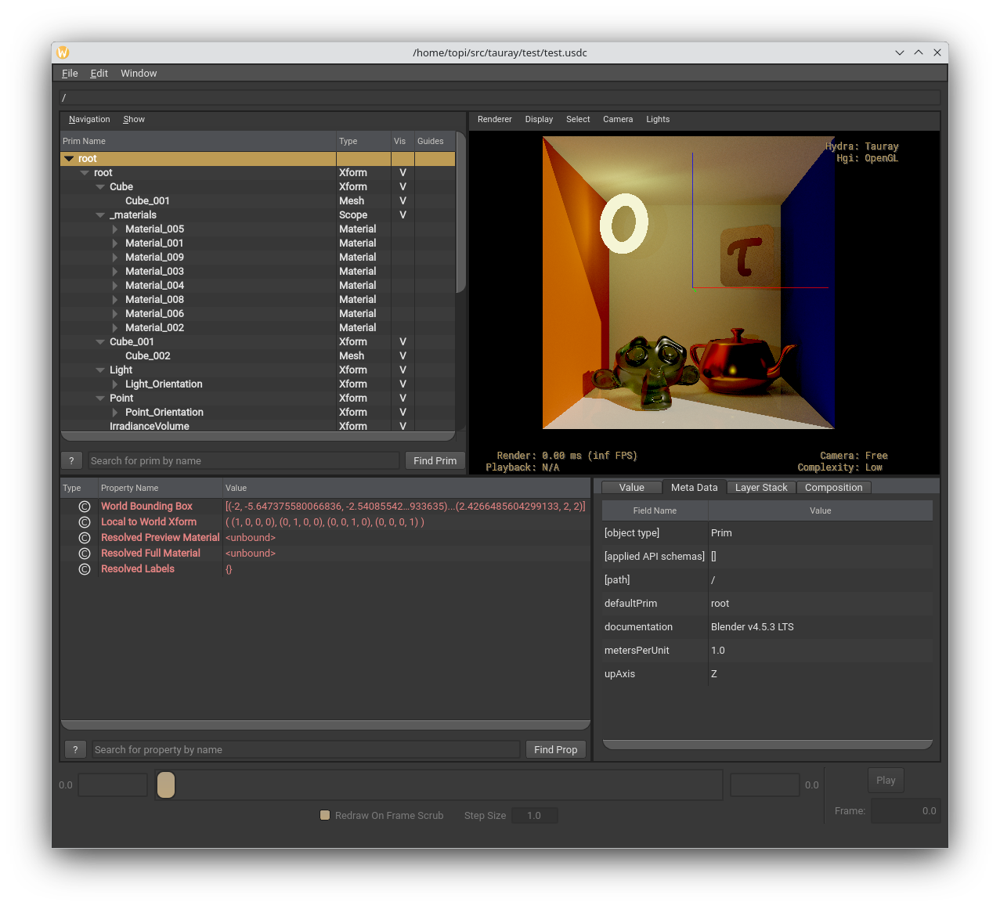

[WIP] Hydra render delegate
==========================
Only tested with usdview and Blender on Arch Linux, ymmv :)



WIP limitations compared to the normal gltf path:
  - Meshes with multiple materials must be split by material before exporting as GeomSubsets are unsupported (see the test scene box)
  - UsdPreviewSurface only supports opacity, which Blender maps to alpha, you must set alpha to 1-transmission before exporting (see the test scene monkey)
  - Spotlights are not implemented as USD doesn't have them directly, instead they should be created using the light shaping api
  - Instancing is not implemented
  - Animations are not implemented

General todo:
  - Support removing objects from the scene
  - Implement envmaps as dome lights
  - Fix USDZ texture loading
  - Mixed primvar interpolation robustness
  - Expose more settings to Hydra
  - Expose depth buffer etc. to Hydra

Out of scope:
  - Subdivision surfaces, materialx, hair, etc. :^)

Building
--------
Clone OpenUSD tag `v25.05.01` from `https://github.com/PixarAnimationStudios/OpenUSD`

Build USD with:

```
python -m venv venv
source venv/bin/activate
pip install pyside6 pyopengl
python build_scripts/build_usd.py --build-monolithic --no-materialx --onetbb --build-args oneTBB,"-DCMAKE_POLICY_VERSION_MINIMUM=3.5" --generator Ninja <usd_build_dir>
```

Next configure Tauray with: `cmake -Bbuild -GNinja -DCMAKE_PREFIX_PATH=<usd_build_dir> -DHYDRA_PLUGIN=1` and build!

Then run usdview with HdTauray enabled:

```
USD_DIR=<usd_build_dir>
PATH=$USD_DIR/bin:$PATH PYTHONPATH=$USD_DIR/lib/python PXR_PLUGINPATH_NAME=$PWD $USD_DIR/bin/usdview test/test.usdc
```

You can configure Tauray with `-DHYDRA_PLUGIN_DEBUG_LOG=1` to enable verbose logging on the render delegate. This can help make sense of the control flow and lifetime of the plugin.

Configuration
-------------
The render delegate currently exposes just a few settings to Hydra:
  - accumulation = < true | false >
  - samples = < target samples per pixel >
  - sample batch = < samples per batch >
  - ray depth = < maximum ray depth >

Defaults can be set with environment variables `HDTAURAY_ACCUMULATE`, `HDTAURAY_SAMPLES`, `HDTAURAY_SAMPLEBATCH` and `HDTAURAY_RAYDEPTH`.

Blender addon
-------------
To use the Blender addon you must compile HdTauray with the same version of USD that Blender uses. The addon has only been tested against the Arch packaged version with USD 25.08 so far. The official 4.5.0 binaries from blender.org come with USD 25.02(?) so you might want to try that on other distros if you can get it to build :)

Original readme
---------------

Tauray
=======

|                                                                          |
|----------------------------------------------------------------------------------------------------------------------------------------------------------|
| The famous "Sponza" scene with teapots. 1920x1080 image (4096 spp, 4 bounces), rendered with Tauray in 15 seconds on a dual-GPU setup with RTX 3090 and RTX 2080 Ti. |

Tauray is a real-time rendering framework, with a focus on distributed computing, scalability,
portability and low latency. It uses C++17 and Vulkan, primarily relying on the `VK_KHR_ray_tracing`
extension, but comes with a fallback rasterization mode that can be used on devices that
do not have that extension.

Tauray development is led by the [VGA research group](https://webpages.tuni.fi/vga/)
in Tampere University. The project is described in a conference publication ([DOI link](https://doi.org/10.1145/3550340.3564225)),
which includes performance benchmarks and more information on Tauray.
[A pre-print is available.](https://webpages.tuni.fi/vga/publications/Tauray2022.pdf)

Measurements in the publication are done with the [v1.0.0 release](https://github.com/vga-group/tauray/releases/tag/v1.0.0).
For practical purposes however, we recommend always using the latest available
release instead, as there are bug fixes and additional features included.

## License

Tauray is licensed under LGPL version 2.1. You can find the license text in
[COPYING.LESSER](COPYING.LESSER). External dependencies in the `external`
folder have their own licenses specified either at the start of each file or as
separate license text files.

## Features

- Real-time path tracing (`--renderer=path-tracer`)
  - Accumulation mode (`--accumulation`)
  - Denoising (`--denoiser=svgf` or `--denoiser=bmfr`)
- ReSTIR DI & PT (`--renderer=restir`)
  - DI is used when (`--max-ray-depth=2`, e.g. single bounce)
  - Supports reconnection shift, random replay shift and hybrid shift
- Offline rendering (`--headless=output_file`)
  - Animations with `--animation`
  - Output file type with `--filetype=[png,exr]`
- DDISH-GI, as used in the [DDISH-GI publication](https://doi.org/10.1007/978-3-030-89029-2_34) (`--renderer=dshgi`)
  - Remote probe rendering (`--renderer=dshgi-server` and `--renderer=dshgi-client`)
  - Note that scenes for DDISH-GI need to be authored to include the probe grid:
    use the included Blender glTF export plugin and place an irradiance volume!
- Multi-GPU rendering (real-time and offline!)
  - All compatible GPUs are used by default (you can limit to one with `--devices=0`)
- Light field rendering
  - Real-time for Looking Glass displays: `--display=looking-glass`
  - Offline: `--camera-grid=w,h,x,y` and `--camera-recentering-distance=distance`
- VR rendering (`--display=openxr`)

And more, [see the user manual for details.](docs/tauray_user_manual.pdf)

## Building

Clone the repository recursively with
`git clone --recursive https://github.com/vga-group/tauray/`.

Tauray has been tested on the Ubuntu 22.04 operating system. Building on Ubuntu
22.04 can be done as follows:

1. Install dependencies: `sudo apt install build-essential cmake libsdl2-dev libglm-dev libczmq-dev libnng-dev libcbor-dev vulkan-tools libvulkan-dev vulkan-validationlayers libxcb-glx0-dev glslang-tools libassimp-dev`
2. `cmake -S . -B build`
3. `cmake --build build`
4. `build/tauray my_scene.glb`

Building with Windows is also possible but not recommended. You can use the
CMakeLists.txt with Visual Studio. A vcpkg.json is provided in this repository
to handle dependencies with Windows builds. Note that multi-GPU rendering is not
supported on Windows.

## Usage

To launch a simple interactive path tracing session with the included test model:

```bash
build/tauray test/test.glb --preset=accumulation
```

[See the user manual for more detailed usage documentation.](docs/tauray_user_manual.pdf)

## Benchmarking with Tauray

To measure representative benchmarks with Tauray, please build a release build
and **disable validation**:

1. Delete your existing build directory (if applicable)
2. `cmake -S . -B build -DCMAKE_BUILD_TYPE=Release`
3. `cmake --build build`
4. `build/tauray --validation=off -t my_scene.glb`

You may also want to set `--force-double-sided` for better performance if your
scene does not require single-sided surfaces. Also, remember to set
`--max-ray-depth` appropriately for the type of benchmark, the default is quite
high. It sets the number of bounces.

By default, Tauray will use all GPUs with support for the required extensions.
If you wish to use a specific GPU on a multi-GPU system, use `--devices=0` (or
any other index; the first thing Tauray prints is the devices it picked.)

In the output with the `-t` flag, lines starting with `HOST: ` are total
frametimes, which you most likely want to measure. The first few frametimes of
a run can be weird as in-flight frames haven't been queued properly and some
initialization still runs, so please exclude those if possible.
`--warmup-frames` can also be used for this purpose.

[See the user manual for more detailed info on configuring Tauray for you benchmark setup.](docs/tauray_user_manual.pdf)

## Citation

If you use Tauray in a research paper, please cite our paper with the
format below:

```bibtex
@inproceedings{Ikkala22,
    author={Ikkala, Julius and Mäkitalo, Markku and Lauttia, Tuomas and Leria, Erwan and Jääskeläinen, Pekka},
    title={Tauray: A Scalable Real-Time Open-Source Path Tracer for Stereo and Light Field Displays},
    year={2022},
    booktitle={SIGGRAPH Asia 2022 Technical Communications},
    series={SA '22 Technical Communications},
    location={Daegu, Republic of Korea},
    doi={10.1145/3550340.3564225},
    address={New York, NY, USA},
    publisher={Association for Computing Machinery},
    url={https://webpages.tuni.fi/vga/publications/Tauray2022.pdf}
}
```
